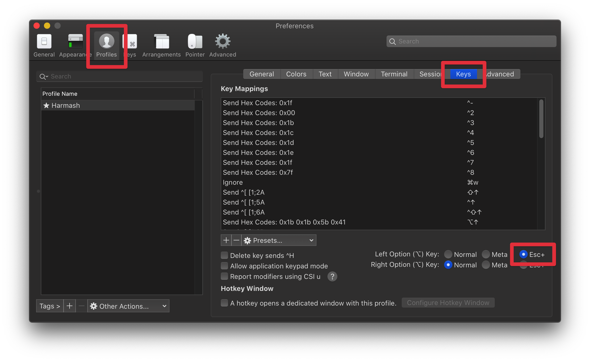

# Git Branches Helper

All native `git switch ⋯` features, plus:
* Interactive UI to view and switch branches
* Branches are sorted by usage recency
* Fuzzy search

See [how it looks](#How-It-Looks-In-Action).

## Install

## Usage

```shell
git jump
```

Run without any arguments to launch [interactive UI](#How-It-Looks-In-Action).

* At first, branches are not sorted. Once you start switching around, `git jump` will track the history and sort the list, so that the most recently used branches are at the top and can be accessed faster.
* Navigate the list with ↓↑ arrows and hit enter ⏎ to switch into selected branch.
* On the left hand side of the list you'll see a number next to a brunch name. Use <kbd>Option</kbd>+<kbd>\<number\></kbd> for quick switch (<kbd>Alt</kbd>+<kbd>\<number\></kbd> on Windows and Linux).
* Start typing to filter the list. The search is fuzzy, you don't have to be precise.

<br />

```shell
git jump <branch name>
```

Switches to a branch. `<branch name>` can be just part of the name, `git jump` will look for the best matching branch.

<br />

```shell
git jump <any native switch arguments>
```

You can use `git jump` as a drop-in replacement for [native `git switch`](https://git-scm.com/docs/git-switch). `git jump` will proxy all the argument to the native command, so you don't have to think to use one or the other.

For example `git jump my-branch --track origin/main --quiet` Works just fine.

<br />

```shell
git jump new <branch name>
```
Creates a new branch and switches into it.

<br />

```shell
git jump rename <branch name> <new branch name>
```
Renames a branch.

<br />
```shell
git jump delete <branch name>
```

Deletes a branch.


## How It Looks In Action

...Video of the tool...


## How To Enable <kbd>Option/Alt</kbd>+<kbd>\<number\></kbd> Shortcut

In some terminals this shortcut might be disabled by default, here is how to make it work in some apps:

### iTerm 2

In Preferences go to `Profiles`, select your profile and go to `Keys`. At the bottom set `Left Option (⌥) Key` to `Esc+`.



### macOS Terminal

In Preferences go to `Profiles`, select your profile and go to `Keyboard`. Enable `Use Option as Meta key` checkbox.


### Hyper

Open `.hyper.js` and add next line to the `config` section:

```js
modifierKeys: { altIsMeta: true }
```


